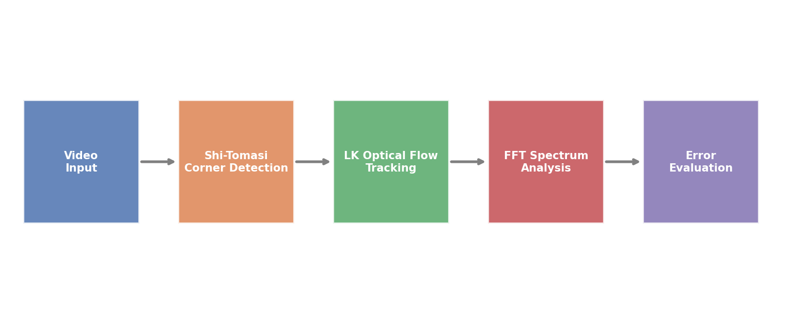
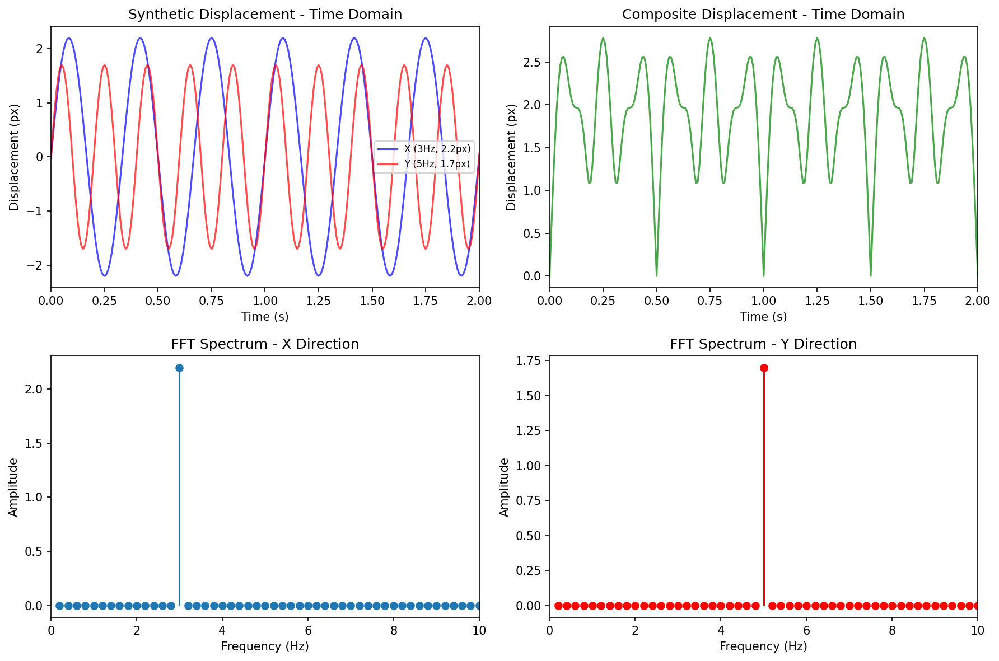
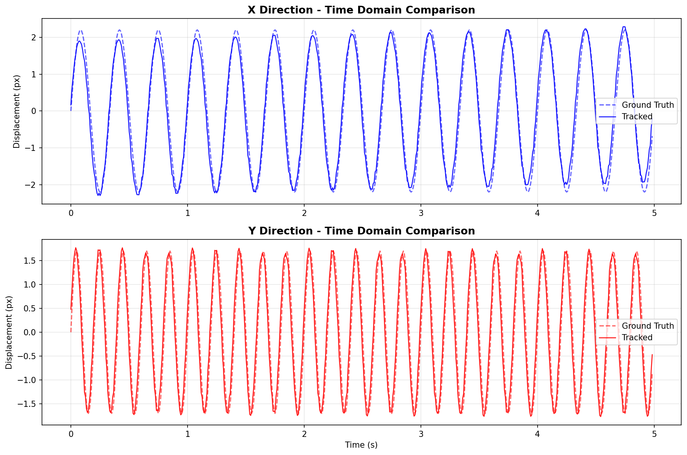
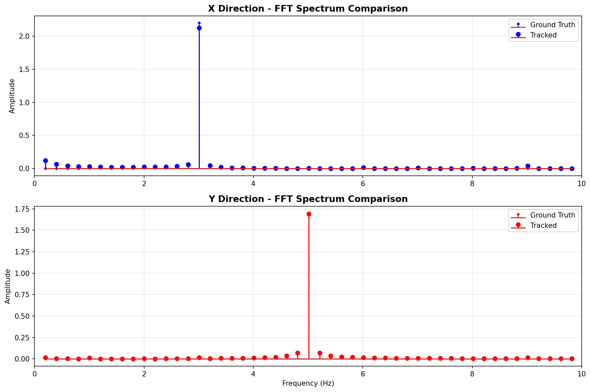
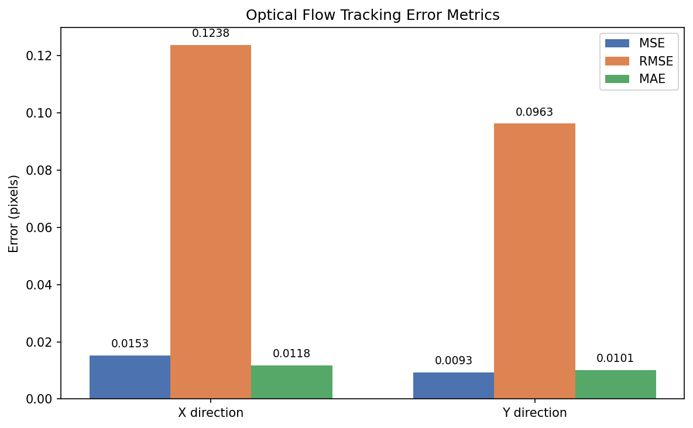

# Structural Vibration Feature Extraction via Computer Vision

## Overview

This project explores non-contact structural vibration displacement measurement using computer vision techniques, addressing the limitations of traditional contact sensors (accelerometers/displacement meters) such as installation complexity and single-point measurement constraints.

## Technical Approach

### 1. Target Tracking & Displacement Extraction
- **Shi-Tomasi corner detection** for initial feature point localization
- **Lucas-Kanade optical flow** with image pyramid for frame-by-frame target tracking
- Extraction of X/Y displacement time-history curves

### 2. Time-Frequency Analysis
- **FFT spectrum analysis** to extract vibration frequency characteristics
- Comparison with ground-truth synthetic sinusoidal displacement signals
- Quantitative error evaluation using **MSE / RMSE / MAE** metrics

### 3. Micro-Vibration Enhancement
- **MOG2 background subtraction** to separate moving foreground from static background
- **Eulerian Video Magnification (EVM)**: Laplacian pyramid decomposition + Butterworth temporal bandpass filtering (0.4–3 Hz)

## Directory Structure

```
structural-vibration-vision/
├── test_video/                          # Test video (input)
│   └── test.avi
├── output_videos/                       # Generated output videos
│   └── out.avi                          # Sample magnified output
├── 01_generate_sine_signals.py          # Generate synthetic sine signals
├── 02_generate_composite_signal.py      # Generate composite displacement signal
├── 03_optical_flow_basic.py             # Basic optical flow tracking
├── 04_optical_flow_final.py             # Final integrated pipeline
├── 05_optical_flow_ground_truth.py      # Tracking vs. ground truth comparison
├── 06_optical_flow_error_metrics.py     # Error evaluation (MSE/RMSE/MAE)
├── 07_optical_flow_xy_analysis.py       # X/Y direction analysis
├── 08_optical_flow_fft_eval.py          # FFT-based frequency evaluation
├── 09_video_magnification_eulerian.py   # Eulerian video magnification
├── 10_video_magnification_bgsub.py      # Background subtraction + magnification
├── .gitignore
└── README.md
```

## File Descriptions

| File | Description |
|------|-------------|
| `01_generate_sine_signals.py` | Generate synthetic sinusoidal displacement (X: 3Hz/2.2px, Y: 5Hz/1.7px) + FFT visualization |
| `02_generate_composite_signal.py` | Generate sqrt(x²+y²) composite displacement + time/frequency-domain plots |
| `03_optical_flow_basic.py` | Shi-Tomasi + LK optical flow tracking + velocity + FFT |
| `04_optical_flow_final.py` | **Final version**: time & frequency dual comparison + X/Y error metrics |
| `05_optical_flow_ground_truth.py` | Optical flow tracking vs. synthetic ground truth |
| `06_optical_flow_error_metrics.py` | MSE/RMSE/MAE error evaluation |
| `07_optical_flow_xy_analysis.py` | X/Y directional time & frequency comparison |
| `08_optical_flow_fft_eval.py` | FFT-based frequency evaluation |
| `09_video_magnification_eulerian.py` | EVM: Laplacian pyramid + Butterworth bandpass filter |
| `10_video_magnification_bgsub.py` | MOG2 background subtraction + temporal filtering + magnification |
| `test_video/test.avi` | Test video for optical flow tracking |

## Dependencies

```bash
pip install numpy opencv-python scipy scikit-learn matplotlib
```

## Running Examples

```bash
# Signal generation (no video needed)
python 01_generate_sine_signals.py
python 02_generate_composite_signal.py

# Optical flow tracking
python 03_optical_flow_basic.py             # Basic tracking
python 04_optical_flow_final.py             # Full pipeline with error metrics
python 06_optical_flow_error_metrics.py     # Error evaluation only

# Video magnification
python 09_video_magnification_eulerian.py   # Eulerian video magnification
python 10_video_magnification_bgsub.py      # Background subtraction + magnification
```

## Results Overview

### Pipeline



### Synthetic Signal Visualization



### Optical Flow Tracking on Test Video

**Tracking Visualization** — green lines show feature point trajectories, colored dots show current positions:


**Time-Domain Comparison** — tracked displacement vs. ground truth (dashed):



**Frequency-Domain Comparison** — FFT spectra of tracked vs. ground truth displacement:



### Error Metrics

| Metric | X Direction (3Hz, 2.2px) | Y Direction (5Hz, 1.7px) |
|--------|:------------------------:|:------------------------:|
| MSE    | 0.0153                   | 0.0093                   |
| RMSE   | 0.1238                   | 0.0963                   |
| MAE    | 0.0118                   | 0.0101                   |



### Video Outputs

- Optical flow scripts generate annotated `.avi` videos (tracking trajectories & feature points) in `output_videos/`
- Magnification scripts (`09` / `10`) output amplified videos with visibly enhanced motion

## Notes

- Code comments are in **Chinese**; run in an environment that supports UTF-8 encoding.
- Output `.avi` files use XVID codec; install FFmpeg if playback issues occur on your platform.
